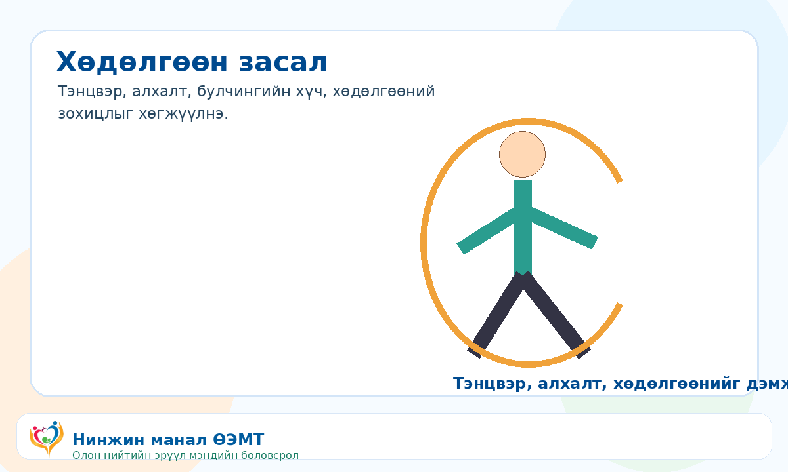

::: {.brand-strip}
{.brand-logo}
:::

::: {.hero-card}

# Аутизм

Аутизмын хүрээний эмгэг нь хүүхдийн харилцаа, нийгмийн харилцан үйлдэл, давтагдмал зан үйл, суралцах хэв маягт нөлөөлж болно.

{.hero-image}

:::

## Анзаарах шинж {#shinj-temdeg}

::: {.topic-section .warning}
- Нэрээр нь дуудахад хариу багатай байх
- Нүдээр харилцах, хамт тоглох сонирхол бага байх
- Хэл яриа хоцрох эсвэл давтагдмал хэллэг хэрэглэх
- Нэг зүйлд хэт төвлөрөх, давтагдмал хөдөлгөөн хийх
- Дуу чимээ, гэрэл, хүрэлцэх мэдрэмжид хэт мэдрэг байх
:::

{.section-image}

## Хэл засал {#hel-zasal}

::: {.topic-section .info}
- Дуу авиа, үг, өгүүлбэрийн хэрэглээг дэмжинэ.
- Харилцах дохио, зураг, карт ашиглаж болно.
- Эцэг эх өдөр тутмын тоглоом, хооллолт, хувцаслах үед үгийг давтан хэрэглэнэ.
:::

{.section-image}

## Хөдөлгөөн засал {#hodolgoon-zasal}

::: {.topic-section .info}
- Тэнцвэр, булчингийн хүч, хөдөлгөөний зохицлыг дэмжинэ.
- Алхах, үсрэх, бөмбөг барих, шидэх зэрэг тоглоомын дасгал хэрэглэж болно.
- Хүүхдийн нас, чадварт тохируулж аажмаар нэмэгдүүлнэ.
:::

{.section-image}

## Хөдөлмөр засал {#hodolmor-zasal}

::: {.topic-section .info}
- Хооллох, хувцаслах, бичих, тоглох зэрэг өдөр тутмын чадварыг дэмжинэ.
- Мэдрэхүйн хэт мэдрэг байдалд тохирсон орчин бүрдүүлнэ.
- Гэр бүлд хэрэгжүүлэх энгийн дадал, хуваарь боловсруулна.
:::

## Өрхийн эмчид хандах {#emch-hyanalt}

::: {.topic-section .info}
- Хөгжлийн хоцрогдол сэжиглэвэл эрт үнэлгээ хийлгэнэ.
- Сонсгол, хараа, хэл яриа, сэтгэлзүй, сэргээн засах мэргэжилтэнтэй хамтарна.
:::

::: {.footer-note}
**© АШУҮИС, оюутан Ш.Жамсранжамц**  
Энэхүү мэдээлэл нь олон нийтийн эрүүл мэндийн боловсролд зориулагдсан бөгөөд эмчийн үзлэг, оношилгоо, эмчилгээг орлохгүй. Яаралтай шинж илэрвэл 103 дуудна уу.
:::

