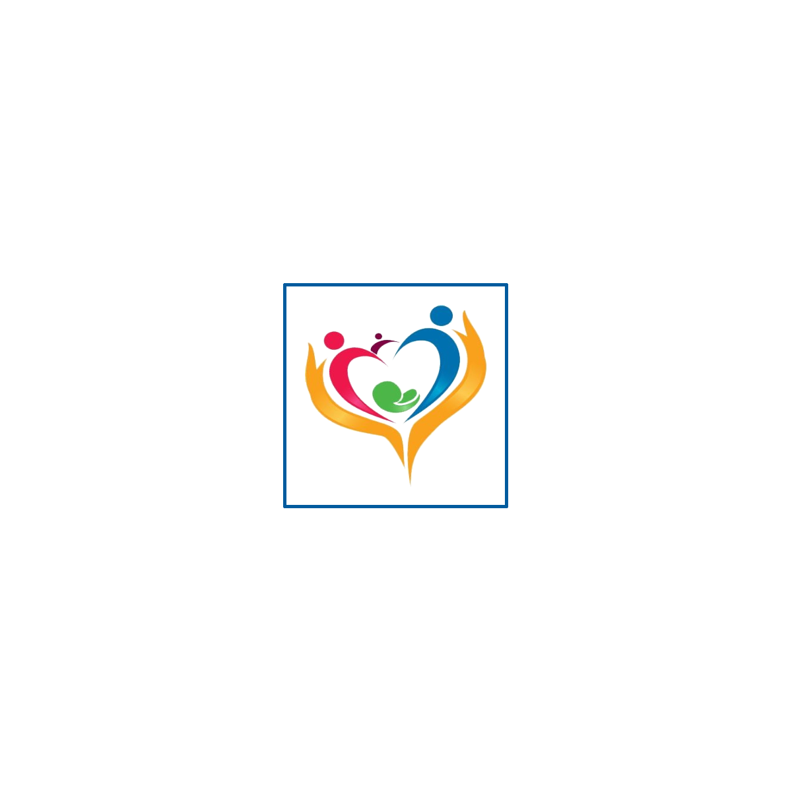

::: {.print-sheet}

::: {.print-header}
{.print-logo}

<h1>QR кодууд</h1>

Нинжин манал ӨЭМТ — олон нийтийн эрүүл мэндийн боловсрол

:::

Нүүр хуудас

Тархины харвалт

Зүрхний шигдээс

Эпилепси

Бөөрний дутагдал

Аутизм

Саажилтын дасгал

Холголт, цооролт

QR татах

Эх сурвалж

B.E.F.A.S.T

Анхаарах шинж

Яаралтай авах арга хэмжээ

Урьдчилан сэргийлэлт

Анхаарах шинж

103 дуудах

Урьдчилан сэргийлэлт

Таталтын үед

Хийж болохгүй

103 дуудах

Эрсдэлт хүчин зүйл

Хяналтын шинжилгээ

Урьдчилан сэргийлэлт

Анзаарах шинж

Хэл засал

Хөдөлгөөн засал

Хөдөлмөр засал

Аюулгүй байдал

::: {.print-footer}
{.print-footer-logo}
**Нинжин манал ӨЭМТ** · © АШУҮИС, оюутан Ш.Жамсранжамц
:::

:::

