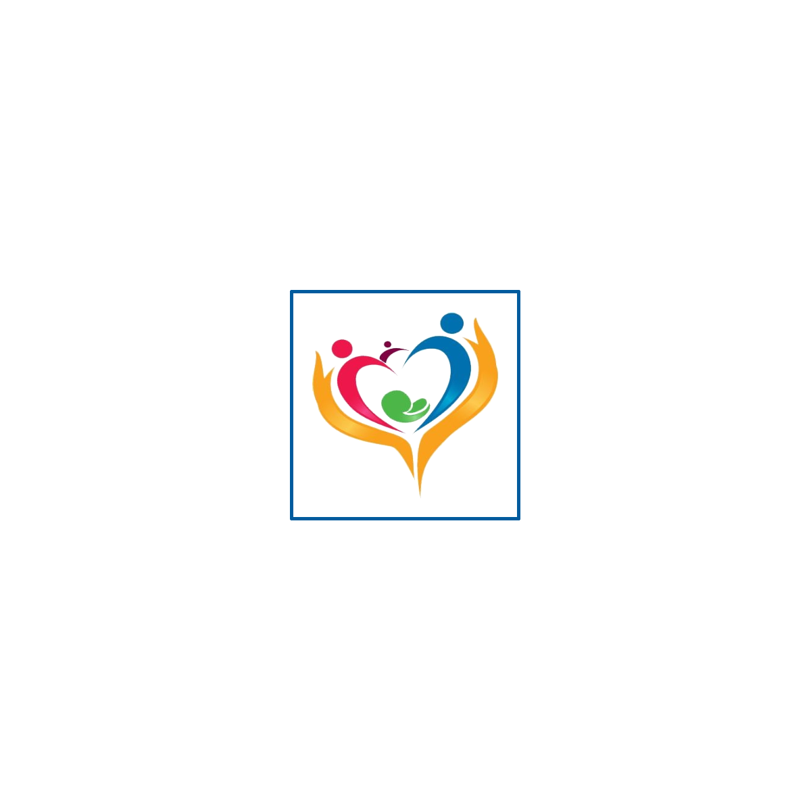

::: {.print-sheet}

::: {.print-header}
{.print-logo}

<h1>Эпилепси</h1>

Таталтын үед хүнийг гэмтлээс хамгаалж, аманд нь юм хийхгүй.

{.print-qr}
:::

{.print-illustration}

::: {.print-main}

## Иргэдэд зориулсан гол зөвлөмж

- Тайван байж, цаг харна. Ойр орчмын хатуу зүйлсийг холдуулна.
- Хажуу тийш байрлуулж амьсгалын замыг чөлөөтэй байлгана.
- 5 минутаас дээш татвал, давтан татвал, гэмтсэн бол 103 дуудна.

## Санамж

Энэхүү мэдээлэл нь олон нийтийн эрүүл мэндийн боловсролд зориулагдсан бөгөөд эмчийн үзлэг, оношилгоо, эмчилгээг орлохгүй. Яаралтай шинж илэрвэл 103 дуудна уу.

:::

::: {.print-footer}
{.print-footer-logo}
**Нинжин манал ӨЭМТ** · © АШУҮИС, оюутан Ш.Жамсранжамц · Яаралтай тусламж: **103**
:::

:::

