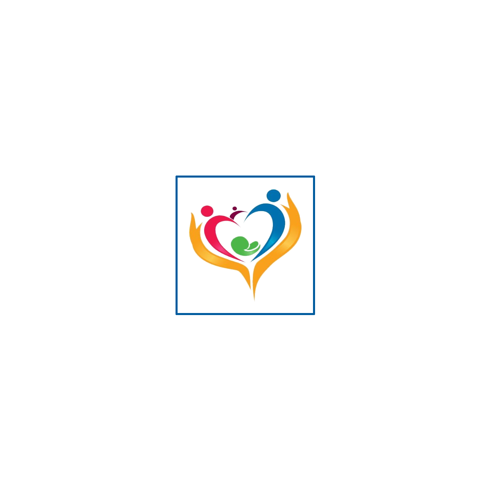
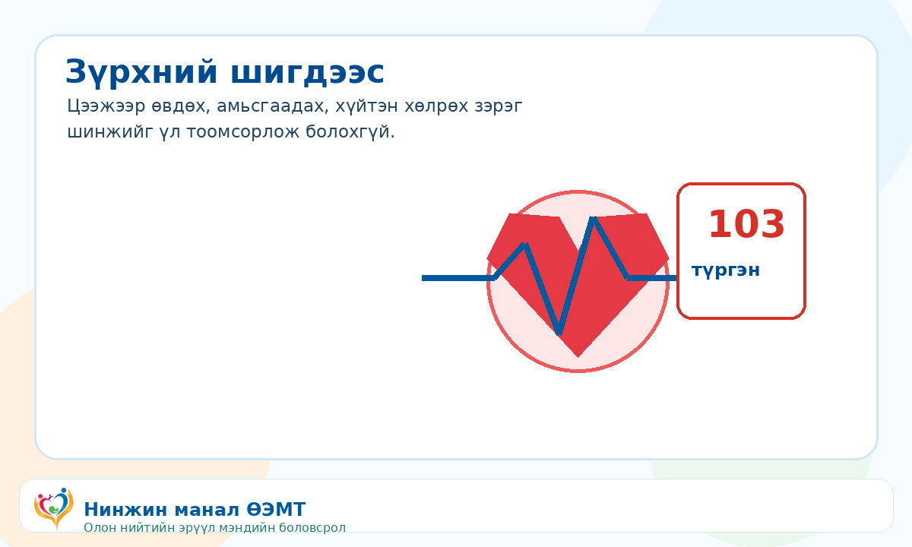

::: {.print-sheet}

::: {.print-header}
{.print-logo}

<h1>Зүрхний шигдээс</h1>

Цээжээр өвдөх, амьсгаадах, хүйтэн хөлрөх үед яаралтай тусламж авна.

{.print-qr}
:::

{.print-illustration}

::: {.print-main}

## Иргэдэд зориулсан гол зөвлөмж

- Цээжээр дарах, шахах мэт өвдөлт 5 минутаас дээш үргэлжилбэл 103 дуудна.
- Өвдөлт гар, мөр, нуруу, хүзүү, эрүү рүү дамжиж болно.
- Даралт, сахар, холестерин, тамхидалтыг хянана.

## Санамж

Энэхүү мэдээлэл нь олон нийтийн эрүүл мэндийн боловсролд зориулагдсан бөгөөд эмчийн үзлэг, оношилгоо, эмчилгээг орлохгүй. Яаралтай шинж илэрвэл 103 дуудна уу.

:::

::: {.print-footer}
{.print-footer-logo}
**Нинжин манал ӨЭМТ** · © АШУҮИС, оюутан Ш.Жамсранжамц · Яаралтай тусламж: **103**
:::

:::

