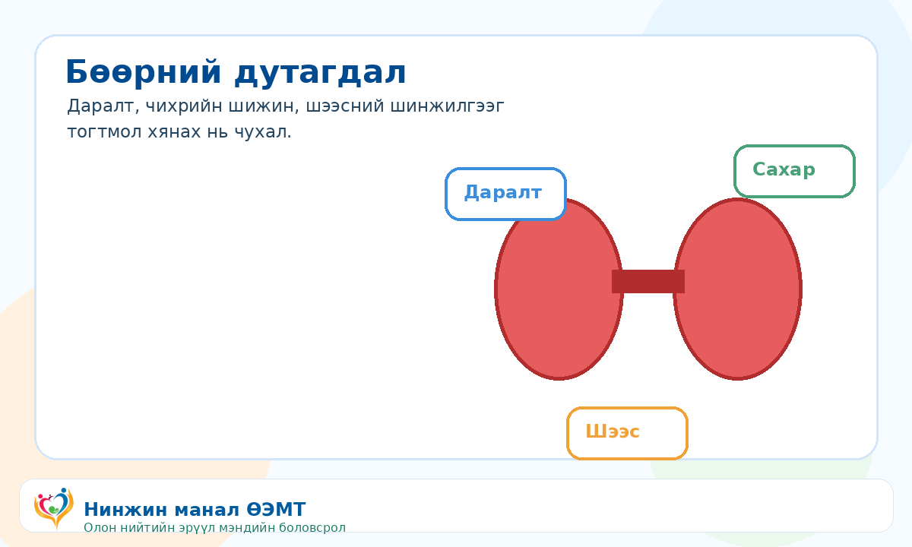

::: {.print-sheet}

::: {.print-header}
{.print-logo}

<h1>Бөөрний дутагдал</h1>

Бөөрний үйл ажиллагаа буурах эрсдэлтэй хүмүүс тогтмол хяналт хийлгэнэ.

{.print-qr}
:::

{.print-illustration}

::: {.print-main}

## Иргэдэд зориулсан гол зөвлөмж

- Чихрийн шижин, даралт ихсэх нь бөөрний өвчний гол эрсдэл.
- Креатинин, eGFR, шээсний шинжилгээг эмчийн зөвлөгөөгөөр өгнө.
- Давс, дур мэдэн эм хэрэглэхээс зайлсхийж даралт, сахараа хянана.

## Санамж

Энэхүү мэдээлэл нь олон нийтийн эрүүл мэндийн боловсролд зориулагдсан бөгөөд эмчийн үзлэг, оношилгоо, эмчилгээг орлохгүй. Яаралтай шинж илэрвэл 103 дуудна уу.

:::

::: {.print-footer}
{.print-footer-logo}
**Нинжин манал ӨЭМТ** · © АШУҮИС, оюутан Ш.Жамсранжамц · Яаралтай тусламж: **103**
:::

:::

