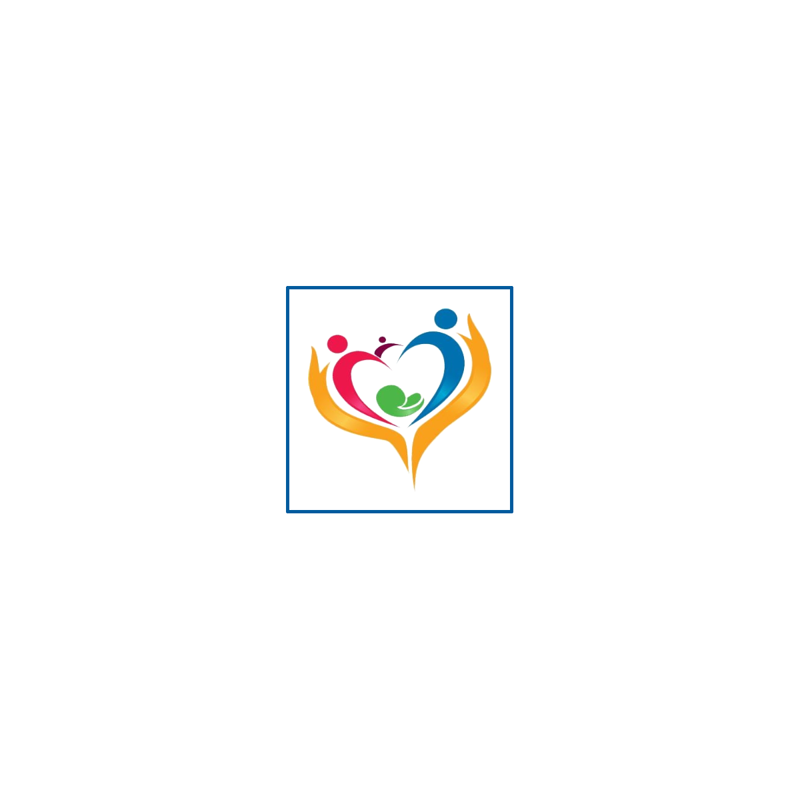

::: {.print-sheet}

::: {.print-header}
{.print-logo}

<h1>Саажилтын дасгал</h1>

Харвалтын дараах дасгалыг аюулгүй, аажмаар, зөвлөгөөгөөр хийнэ.

{.print-qr}
:::

{.print-illustration}

::: {.print-main}

## Иргэдэд зориулсан гол зөвлөмж

- Өвдөлт, толгой эргэх, амьсгаадах үед дасгалыг зогсооно.
- Гар, их бие, хөлийн дасгалыг бага давтамжаас эхэлнэ.
- Уналтаас сэргийлж асран хамгаалагчтай, түшлэгтэй хийнэ.

## Санамж

Энэхүү мэдээлэл нь олон нийтийн эрүүл мэндийн боловсролд зориулагдсан бөгөөд эмчийн үзлэг, оношилгоо, эмчилгээг орлохгүй. Яаралтай шинж илэрвэл 103 дуудна уу.

:::

::: {.print-footer}
{.print-footer-logo}
**Нинжин манал ӨЭМТ** · © АШУҮИС, оюутан Ш.Жамсранжамц · Яаралтай тусламж: **103**
:::

:::

