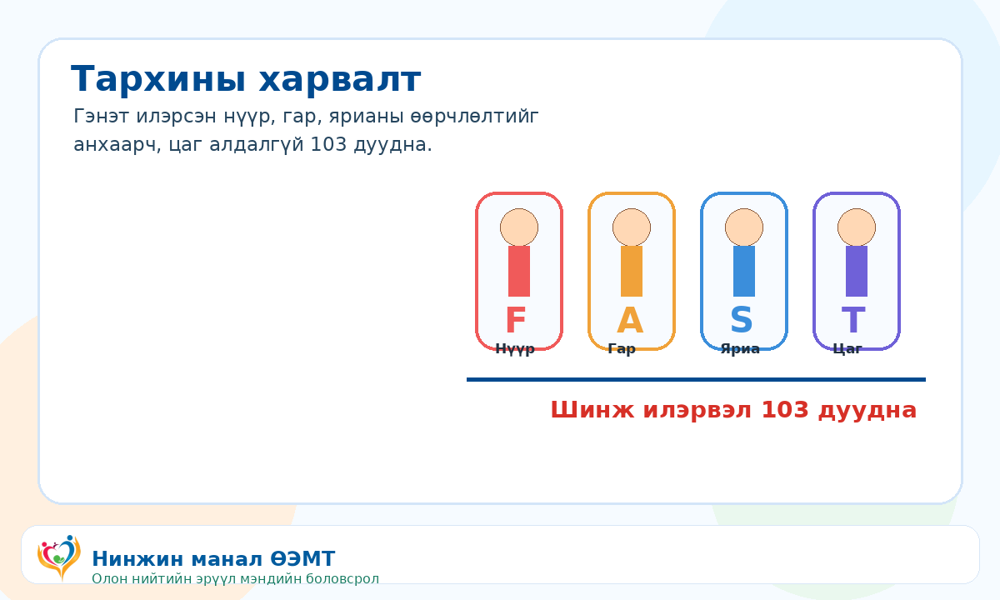

::: {.print-sheet}

::: {.print-header}
{.print-logo}

<h1>Тархины харвалт</h1>

Тархины харвалтын шинж илэрвэл цаг алдалгүй 103 дуудна.

{.print-qr}
:::

{.print-illustration}

::: {.print-main}

## Иргэдэд зориулсан гол зөвлөмж

- B.E.F.A.S.T аргыг сана: Balance, Eyes, Face, Arm, Speech, Time.
- Нүүр унжих, гар сулрах, хэл ээдрэх, хараа өөрчлөгдөх нь аюултай шинж.
- Хоол, ус, эм дур мэдэн өгөхгүй. Шинж эхэлсэн цагийг тэмдэглэнэ.

## Санамж

Энэхүү мэдээлэл нь олон нийтийн эрүүл мэндийн боловсролд зориулагдсан бөгөөд эмчийн үзлэг, оношилгоо, эмчилгээг орлохгүй. Яаралтай шинж илэрвэл 103 дуудна уу.

:::

::: {.print-footer}
{.print-footer-logo}
**Нинжин манал ӨЭМТ** · © АШУҮИС, оюутан Ш.Жамсранжамц · Яаралтай тусламж: **103**
:::

:::

