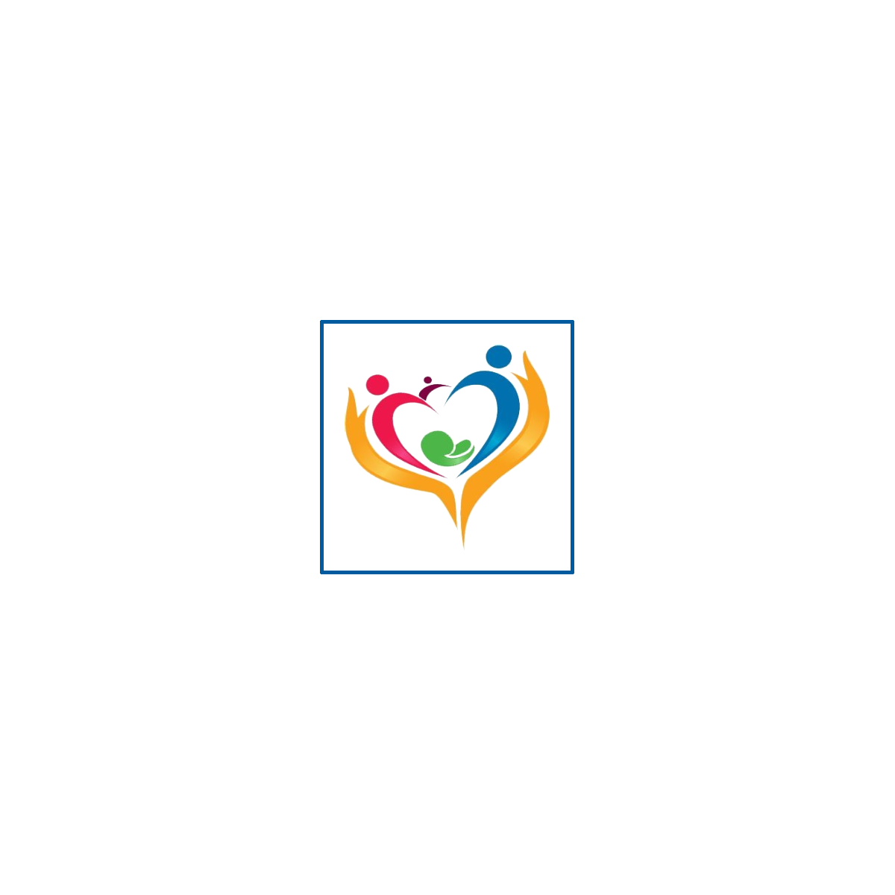

::: {.brand-strip}
{.brand-logo}
:::

# QR кодууд

::: {.qr-grid}
::: {.qr-card}
{.qr-img}

**Нүүр хуудас**

[`home.png`](qr/home.png)
:::

::: {.qr-card}
{.qr-img}

**Тархины харвалт**

[`stroke.png`](qr/stroke.png)
:::

::: {.qr-card}
{.qr-img}

**Зүрхний шигдээс**

[`heart-attack.png`](qr/heart-attack.png)
:::

::: {.qr-card}
{.qr-img}

**Эпилепси**

[`epilepsy.png`](qr/epilepsy.png)
:::

::: {.qr-card}
{.qr-img}

**Бөөрний дутагдал**

[`kidney-failure.png`](qr/kidney-failure.png)
:::

::: {.qr-card}
{.qr-img}

**Аутизм**

[`autism.png`](qr/autism.png)
:::

::: {.qr-card}
{.qr-img}

**Саажилтын дасгал**

[`post-stroke-exercises.png`](qr/post-stroke-exercises.png)
:::

::: {.qr-card}
{.qr-img}

**Холголт, цооролт**

[`pressure-injury.png`](qr/pressure-injury.png)
:::

::: {.qr-card}
{.qr-img}

**QR татах**

[`downloads.png`](qr/downloads.png)
:::

::: {.qr-card}
{.qr-img}

**Эх сурвалж**

[`references.png`](qr/references.png)
:::

::: {.qr-card}
{.qr-img}

**B.E.F.A.S.T**

[`stroke-be-fast.png`](qr/stroke-be-fast.png)
:::

::: {.qr-card}
{.qr-img}

**Анхаарах шинж**

[`stroke-warning.png`](qr/stroke-warning.png)
:::

::: {.qr-card}
{.qr-img}

**Яаралтай авах арга хэмжээ**

[`stroke-action.png`](qr/stroke-action.png)
:::

::: {.qr-card}
{.qr-img}

**Урьдчилан сэргийлэлт**

[`stroke-prevention.png`](qr/stroke-prevention.png)
:::

::: {.qr-card}
{.qr-img}

**Анхаарах шинж**

[`heart-symptoms.png`](qr/heart-symptoms.png)
:::

::: {.qr-card}
{.qr-img}

**103 дуудах**

[`heart-call.png`](qr/heart-call.png)
:::

::: {.qr-card}
{.qr-img}

**Урьдчилан сэргийлэлт**

[`heart-prevention.png`](qr/heart-prevention.png)
:::

::: {.qr-card}
{.qr-img}

**Таталтын үед**

[`epilepsy-firstaid.png`](qr/epilepsy-firstaid.png)
:::

::: {.qr-card}
{.qr-img}

**Хийж болохгүй**

[`epilepsy-dont.png`](qr/epilepsy-dont.png)
:::

::: {.qr-card}
{.qr-img}

**103 дуудах**

[`epilepsy-call.png`](qr/epilepsy-call.png)
:::

::: {.qr-card}
{.qr-img}

**Эрсдэлт хүчин зүйл**

[`kidney-risk.png`](qr/kidney-risk.png)
:::

::: {.qr-card}
{.qr-img}

**Хяналтын шинжилгээ**

[`kidney-tests.png`](qr/kidney-tests.png)
:::

::: {.qr-card}
{.qr-img}

**Урьдчилан сэргийлэлт**

[`kidney-prevention.png`](qr/kidney-prevention.png)
:::

::: {.qr-card}
{.qr-img}

**Анзаарах шинж**

[`autism-signs.png`](qr/autism-signs.png)
:::

::: {.qr-card}
{.qr-img}

**Хэл засал**

[`autism-speech.png`](qr/autism-speech.png)
:::

::: {.qr-card}
{.qr-img}

**Хөдөлгөөн засал**

[`autism-movement.png`](qr/autism-movement.png)
:::

::: {.qr-card}
{.qr-img}

**Хөдөлмөр засал**

[`autism-occupation.png`](qr/autism-occupation.png)
:::

::: {.qr-card}
{.qr-img}

**Аюулгүй байдал**

[`exercise-safety.png`](qr/exercise-safety.png)
:::

::: {.qr-card}
{.qr-img}

**Гарын дасгал**

[`exercise-arm.png`](qr/exercise-arm.png)
:::

::: {.qr-card}
{.qr-img}

**Их бие**

[`exercise-trunk.png`](qr/exercise-trunk.png)
:::

::: {.qr-card}
{.qr-img}

**Хөлийн дасгал**

[`exercise-leg.png`](qr/exercise-leg.png)
:::

::: {.qr-card}
{.qr-img}

**Ойлголт**

[`pressure-what.png`](qr/pressure-what.png)
:::

::: {.qr-card}
{.qr-img}

**Урьдчилан сэргийлэлт**

[`pressure-prevention.png`](qr/pressure-prevention.png)
:::

::: {.qr-card}
{.qr-img}

**Анхаарах шинж**

[`pressure-warning.png`](qr/pressure-warning.png)
:::

::: {.qr-card}
{.qr-img}

**Байрлал солих**

[`pressure-position.png`](qr/pressure-position.png)
:::
:::

# Хэвлэх A4 хувилбарууд

- [Тархины харвалт хэвлэх хувилбар](print/stroke-print.html)
- [Зүрхний шигдээс хэвлэх хувилбар](print/heart-attack-print.html)
- [Эпилепси хэвлэх хувилбар](print/epilepsy-print.html)
- [Бөөрний дутагдал хэвлэх хувилбар](print/kidney-failure-print.html)
- [Аутизм хэвлэх хувилбар](print/autism-print.html)
- [Саажилтын дасгал хэвлэх хувилбар](print/post-stroke-exercises-print.html)
- [Холголт, цооролт хэвлэх хувилбар](print/pressure-injury-print.html)
- [Бүх QR хэвлэх хувилбар](print/all-qr-print.html)

::: {.footer-note}
**© АШУҮИС, оюутан Ш.Жамсранжамц**  
Энэхүү мэдээлэл нь олон нийтийн эрүүл мэндийн боловсролд зориулагдсан бөгөөд эмчийн үзлэг, оношилгоо, эмчилгээг орлохгүй. Яаралтай шинж илэрвэл 103 дуудна уу.
:::

