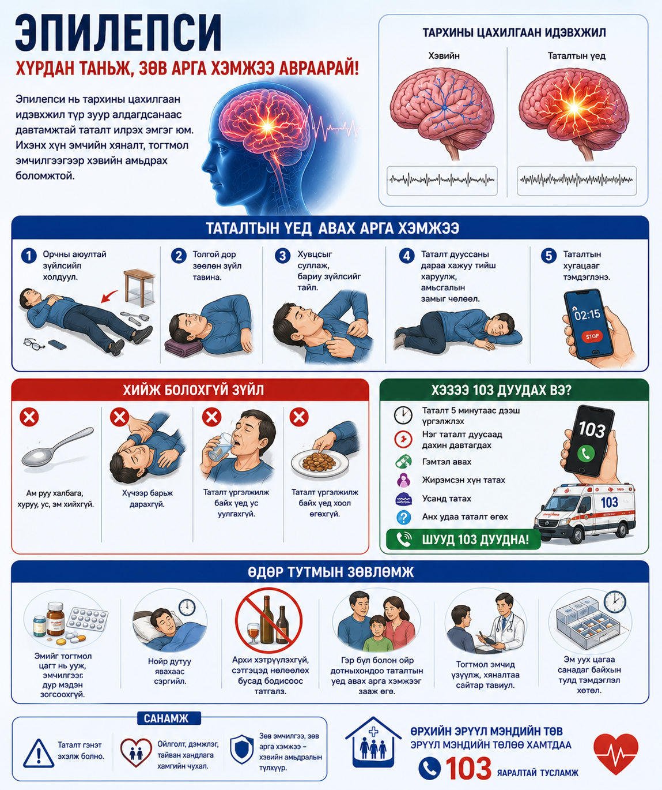

# Эпилепси

Эпилепси нь давтан таталт үүсэх хандлагатай мэдрэлийн тогтолцооны эмгэг юм. Таталтын үед зөв байрлал, аюулгүй орчин хамгаалалт хамгийн чухал.

## Таталтын үед авах арга хэмжээ

Хүнийг аюулгүй орчинд байрлуулж, толгой доор зөөлөн зүйл тавина. Боломжтой бол хажуу тийш харуулж амьсгалыг чөлөөлнө.

## Хийж болохгүй зүйл

Ам руу юм хийхгүй, хүчээр барьж дарахгүй, таталтын үед ус уулгахгүй.

## Хэзээ 103 дуудах вэ?

Таталт 5 минутаас дээш үргэлжилбэл, давтан татвал, амьсгал хэвийн бус бол, гэмтэл авсан бол 103 дуудна.

## Гэр бүлд өгөх санамж

Таталтын хугацааг тэмдэглэж, давтамж, нөхцөл байдлыг эмчид мэдээлнэ.

## A4 инфографик poster

Энэ сэдвийн A4 infographic poster доор preview хэлбэрээр байрласан. Poster-ийг томоор нээж, хэвлэх боломжтой.

  

  
<h3>Poster нээх</h3>
<a class="btn" href="print-epilepsy.html">A4 poster нээх / хэвлэх</a>

  
<h3>A4 poster QR</h3>

  
  
<strong>Нинжин манал ӨЭМТ</strong> 
  Оюуны өмч: © АШУҮИС, оюутан Ш.Жамсранжамц 
  Энэхүү мэдээлэл нь олон нийтийн эрүүл мэндийн боловсролд зориулагдсан бөгөөд эмчийн үзлэг, оношилгоо, эмчилгээг орлохгүй. 
  <a href="https://www.facebook.com/profile.php?id=61575824979556" target="_blank" rel="noopener">Facebook хуудас</a>

