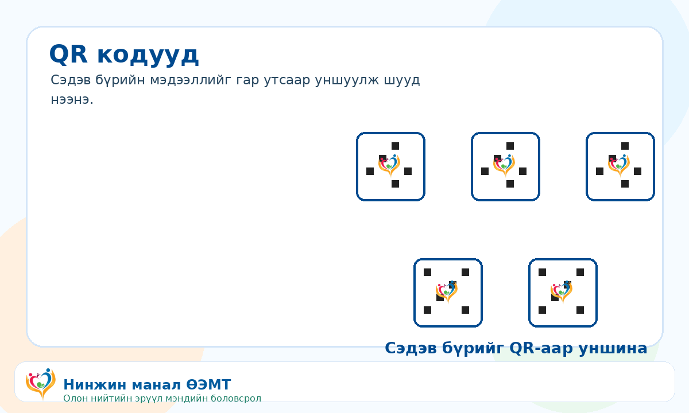
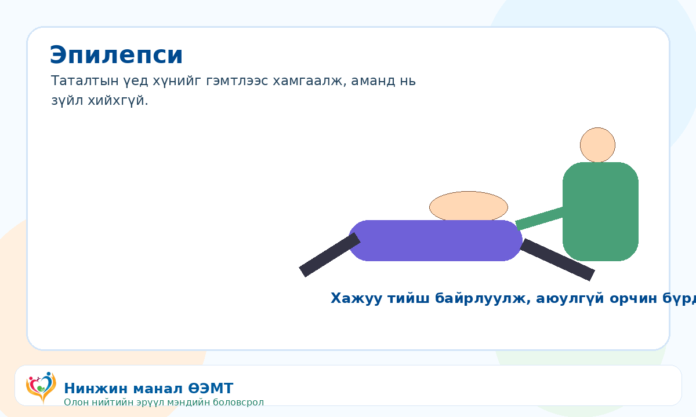
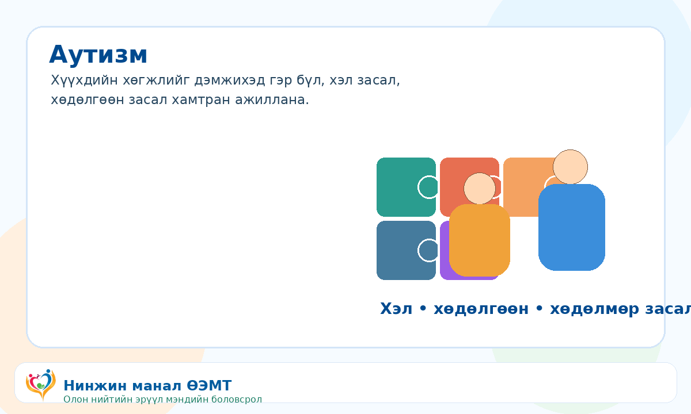
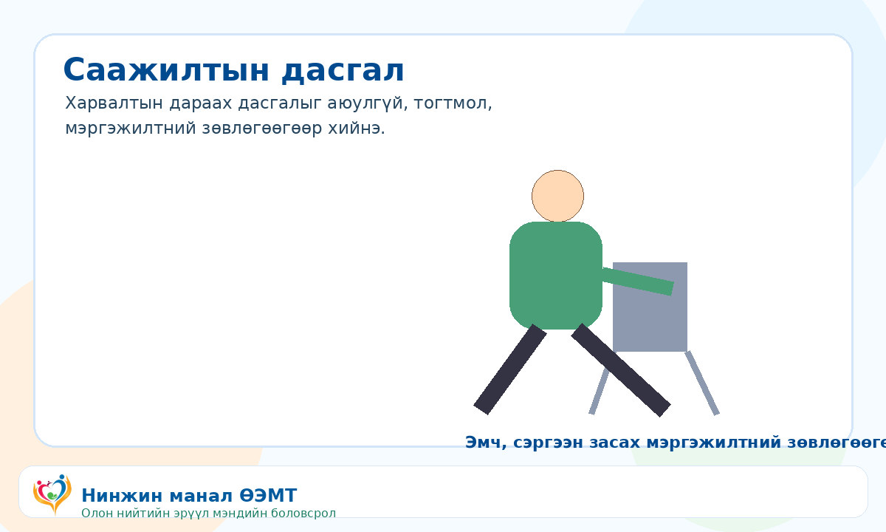
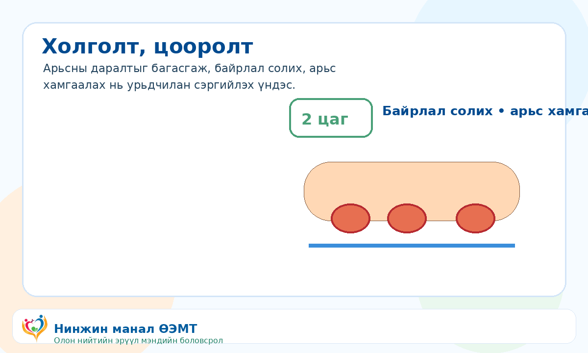

::: {.brand-strip}
{.brand-logo}
:::

::: {.hero-card}

# Нинжин манал ӨЭМТ

Өрхийн эрүүл мэндийн төвөөс олон нийтэд зориулсан эрүүл мэндийн боловсролын QR сайт.

{.hero-image}

:::

::: {.home-grid}
[

**Тархины цус харвалт**

Дэлгэрэнгүй](stroke.qmd){.home-card}

[

**Зүрхний шигдээс**

Дэлгэрэнгүй](heart-attack.qmd){.home-card}

[

**Эпилепси**

Дэлгэрэнгүй](epilepsy.qmd){.home-card}

[

**Бөөрний дутагдал**

Дэлгэрэнгүй](kidney-failure.qmd){.home-card}

[

**Аутизм**

Дэлгэрэнгүй](autism.qmd){.home-card}

[

**Саажилтын дасгал**

Дэлгэрэнгүй](post-stroke-exercises.qmd){.home-card}

[

**Холголт, цооролт**

Дэлгэрэнгүй](pressure-injury.qmd){.home-card}

[

**QR кодууд**

Татах](downloads.qmd){.home-card}
:::

::: {.footer-note}
**© АШУҮИС, оюутан Ш.Жамсранжамц**  
Энэхүү мэдээлэл нь олон нийтийн эрүүл мэндийн боловсролд зориулагдсан бөгөөд эмчийн үзлэг, оношилгоо, эмчилгээг орлохгүй. Яаралтай шинж илэрвэл 103 дуудна уу.
:::

