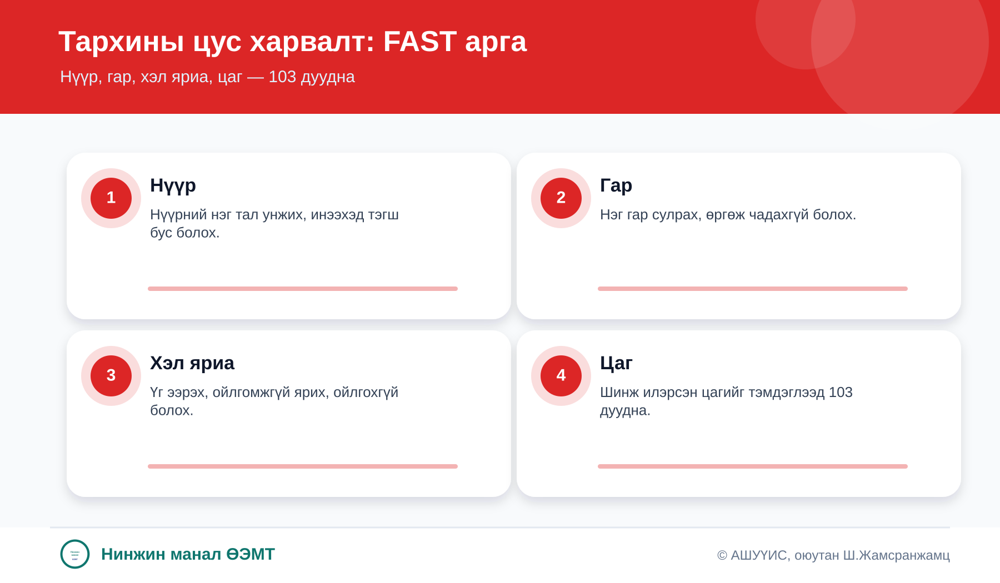
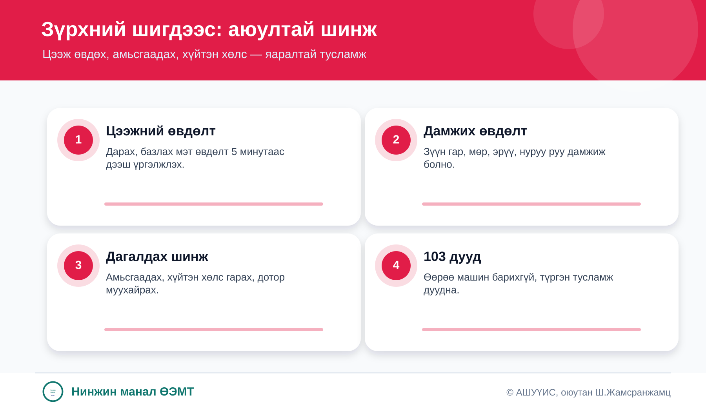
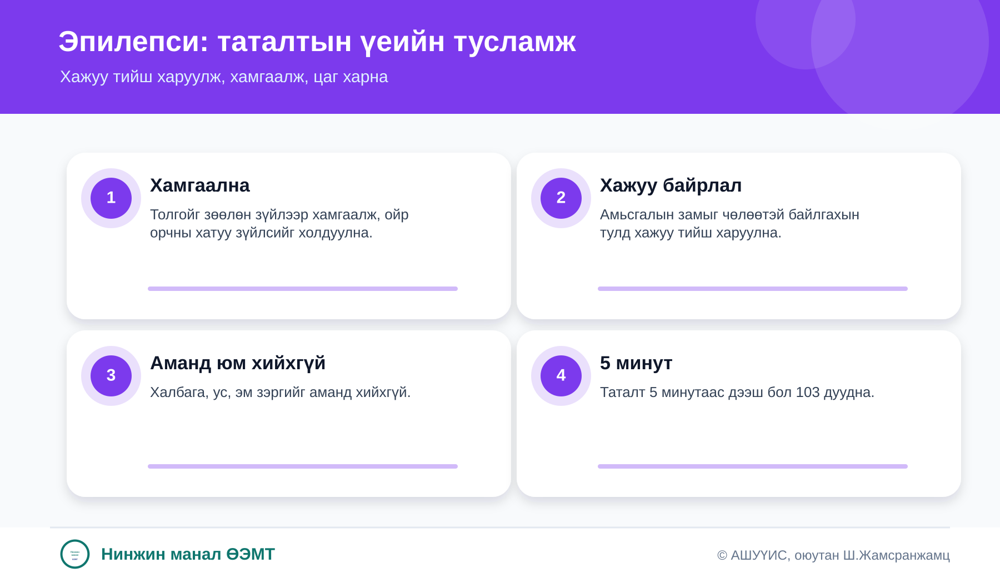
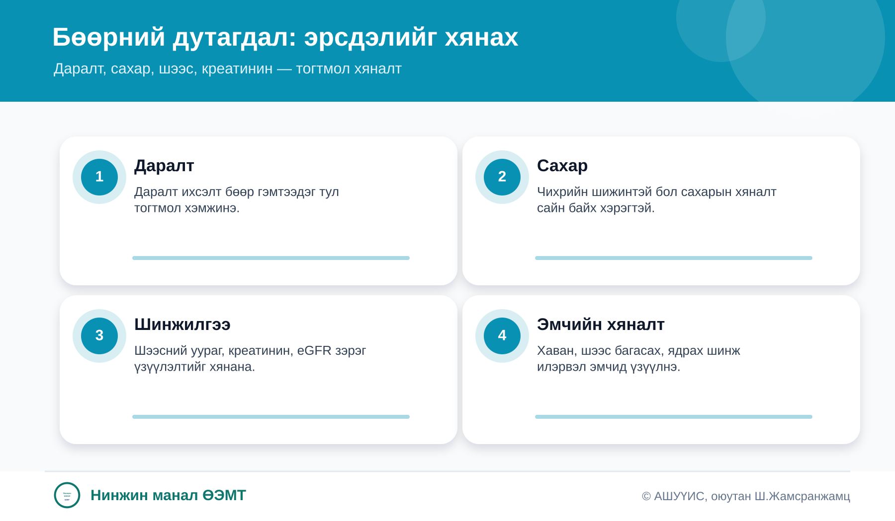
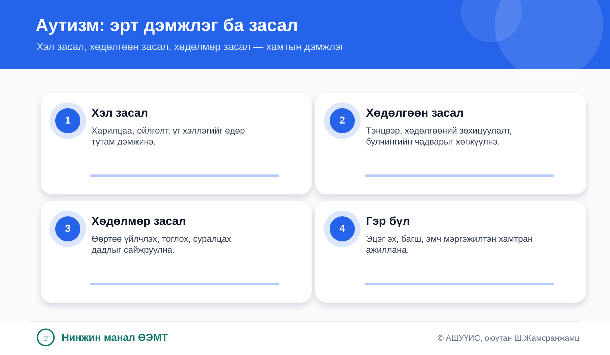
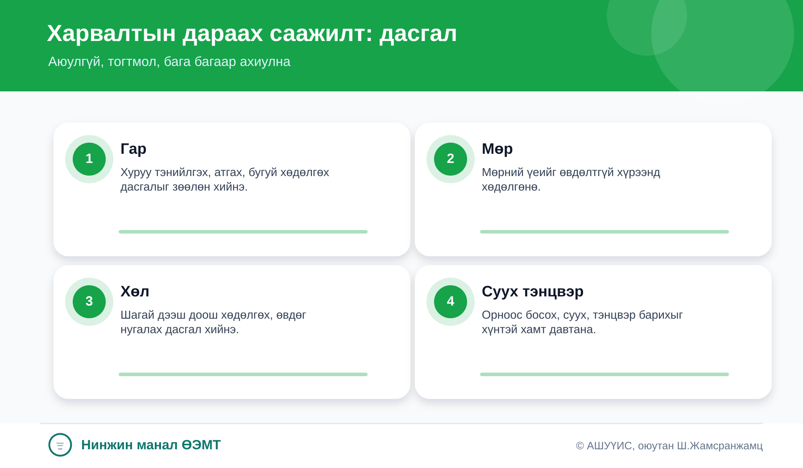
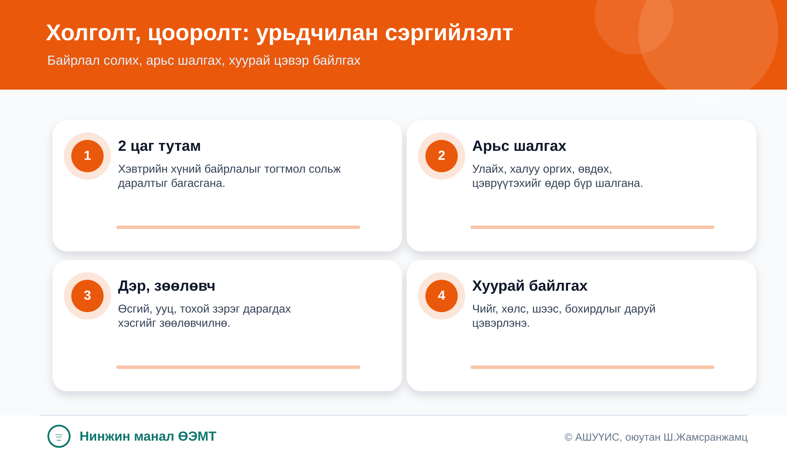

<h1>Нинжин манал ӨЭМТ</h1>
Өрхийн эмнэлгээс иргэдэд зориулсан эрүүл мэндийн боловсролын цахим зөвлөмж. QR код уншуулаад хаанаас ч үзэх боломжтой.

QR-аар уншинаA4 хэвлэх боломжтойИргэдэд ойлгомжтой

<strong>Анхааруулга:</strong> Яаралтай шинж илэрвэл 103 болон ойролцоох эрүүл мэндийн байгууллагад хандана уу.

## Сэдвүүд

<h3>Тархины цус харвалт</h3>

FAST аргаар шинжийг таньж, цаг алдалгүй 103 дуудна.

<a class="btn-main" href="stroke.html">Дэлгэрэнгүй</a>
<a class="btn-secondary" href="print/stroke-print.html">A4 хэвлэх</a>

<h3>Зүрхний шигдээс</h3>

Цээж базлах, амьсгаадах, хүйтэн хөлс гарах үед яаралтай тусламж дуудна.

<a class="btn-main" href="heart-attack.html">Дэлгэрэнгүй</a>
<a class="btn-secondary" href="print/heart-attack-print.html">A4 хэвлэх</a>

<h3>Эпилепси</h3>

Таталтын үед хүнийг хамгаалж, хажуу тийш харуулж, аманд зүйл хийхгүй.

<a class="btn-main" href="epilepsy.html">Дэлгэрэнгүй</a>
<a class="btn-secondary" href="print/epilepsy-print.html">A4 хэвлэх</a>

<h3>Бөөрний дутагдал</h3>

Даралт, сахар, шээс, креатининыг тогтмол хянах нь бөөр хамгаална.

<a class="btn-main" href="kidney-failure.html">Дэлгэрэнгүй</a>
<a class="btn-secondary" href="print/kidney-failure-print.html">A4 хэвлэх</a>

<h3>Аутизм ба засал</h3>

Хүүхдийн харилцаа, хэл яриа, хөдөлгөөн, өдөр тутмын чадварыг эрт дэмжинэ.

<a class="btn-main" href="autism.html">Дэлгэрэнгүй</a>
<a class="btn-secondary" href="print/autism-print.html">A4 хэвлэх</a>

<h3>Саажилтын үеийн дасгал</h3>

Харвалтын дараах дасгалыг аюулгүй, бага багаар, тогтмол хийдэг.

<a class="btn-main" href="post-stroke-exercises.html">Дэлгэрэнгүй</a>
<a class="btn-secondary" href="print/post-stroke-exercises-print.html">A4 хэвлэх</a>

<h3>Холголт, цооролт</h3>

Байрлал солих, арьсаа шалгах, хуурай цэвэр байлгах нь хамгийн чухал.

<a class="btn-main" href="pressure-injury.html">Дэлгэрэнгүй</a>
<a class="btn-secondary" href="print/pressure-injury-print.html">A4 хэвлэх</a>

<strong>Нинжин манал ӨЭМТ</strong>

© АШУҮИС, оюутан Ш.Жамсранжамц

Энэхүү мэдээлэл нь олон нийтийн эрүүл мэндийн боловсролд зориулагдсан бөгөөд эмчийн үзлэг, оношилгоо, эмчилгээг орлохгүй. Яаралтай шинж илэрвэл 103 болон ойролцоох эрүүл мэндийн байгууллагад хандана уу.

