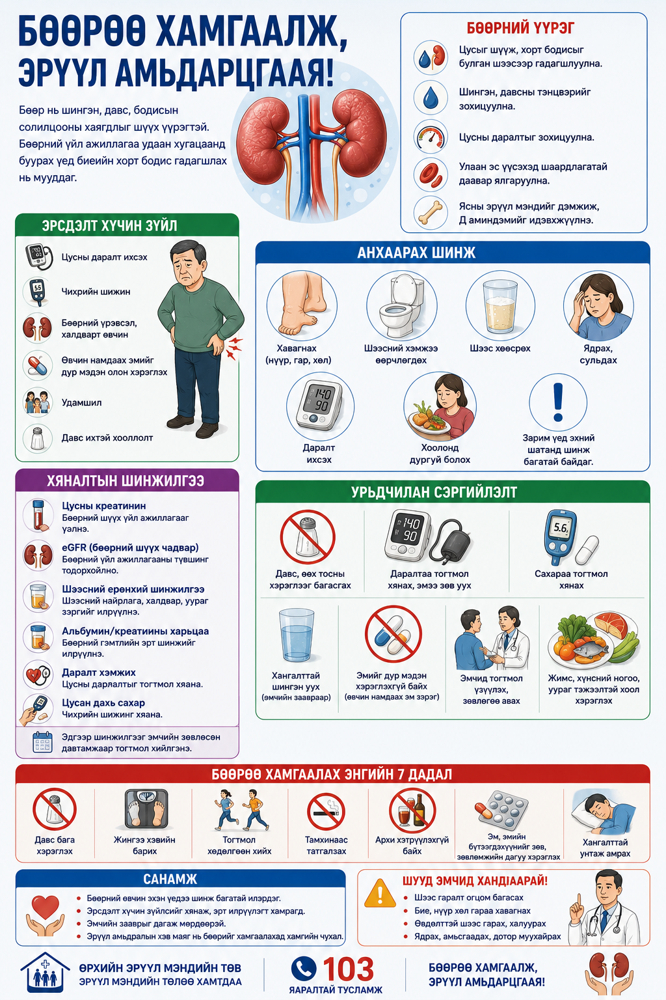
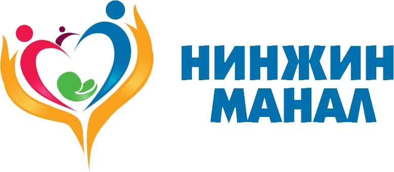

# Бөөрний дутагдал

Бөөр нь биеийн илүүдэл шингэн, бодисын солилцооны хаягдлыг гадагшлуулах, даралт болон эрдэс тэнцвэрт оролцдог чухал эрхтэн юм.

## Эрсдэлт хүчин зүйл

Чихрийн шижин, даралт ихсэлт, бөөрний архаг үрэвсэл, эмийг дур мэдэн хэрэглэх, давс ихтэй хооллолт нь эрсдэлийг нэмэгдүүлдэг.

## Анхаарах шинж

Хавагнах, шээс багасах, ядрах, даралт ихсэх, хоолонд дургүй болох зэрэг шинж илэрвэл эмчид хандана.

## Хяналт

Даралт, сахар, шээс, креатинин зэрэг шинжилгээг эмчийн зөвлөсөн хугацаанд өгнө.

## Урьдчилан сэргийлэлт

Давс багасгах, усны хэрэглээг эмчийн зөвлөснөөр тохируулах, эмийг дур мэдэн хэрэглэхгүй байх нь чухал.

## A4 инфографик poster

Энэ сэдвийн A4 infographic poster доор preview хэлбэрээр байрласан. Poster-ийг томоор нээж, хэвлэх боломжтой.

  

  
<h3>Poster нээх</h3>
<a class="btn" href="print-kidney-failure.html">A4 poster нээх / хэвлэх</a>

  
<h3>A4 poster QR</h3>

  
  
<strong>Нинжин манал ӨЭМТ</strong> 
  Оюуны өмч: © АШУҮИС, оюутан Ш.Жамсранжамц 
  Энэхүү мэдээлэл нь олон нийтийн эрүүл мэндийн боловсролд зориулагдсан бөгөөд эмчийн үзлэг, оношилгоо, эмчилгээг орлохгүй. 
  <a href="https://www.facebook.com/profile.php?id=61575824979556" target="_blank" rel="noopener">Facebook хуудас</a>

