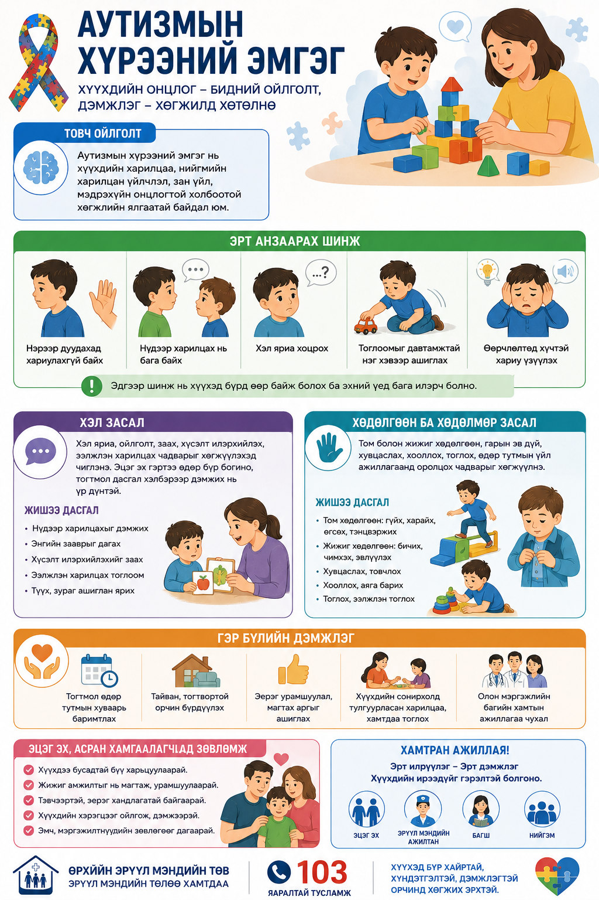

# Аутизм ба хөгжлийн дэмжлэг

Аутизмын хүрээний эмгэг нь хүүхдийн харилцаа, нийгмийн оролцоо, зан үйл, мэдрэхүйн онцлогтой холбоотой байж болно. Эрт дэмжлэг чухал.

## Эрт ажиглалт

Нэрээр дуудахад хариулах, нүдний контакт, тоглоомын хэлбэр, давтагдсан зан үйл, хэл ярианы хөгжил зэргийг ажиглана.

## Хэл засал

Хэл яриа, ойлголт, харилцааны чадварыг хөгжүүлэх тогтмол дэмжлэг шаардлагатай байж болно.

## Хөдөлгөөн ба хөдөлмөр засал

Нарийн болон том хөдөлгөөн, өдөр тутмын үйл ажиллагаа, мэдрэхүйн зохицуулалтыг дэмжинэ.

## Гэр бүлийн дэмжлэг

Тогтмол дэглэм, эерэг харилцаа, ойлголттой орчин хүүхдэд чухал.

## A4 инфографик poster

Энэ сэдвийн A4 infographic poster доор preview хэлбэрээр байрласан. Poster-ийг томоор нээж, хэвлэх боломжтой.

<h3>Poster нээх</h3>
<a class="btn" href="print-autism.html">A4 poster нээх / хэвлэх</a>

<h3>A4 poster QR</h3>

<strong>Нинжин манал ӨЭМТ</strong> 
Оюуны өмч: © АШУҮИС, оюутан Ш.Жамсранжамц 
Энэхүү мэдээлэл нь олон нийтийн эрүүл мэндийн боловсролд зориулагдсан бөгөөд эмчийн үзлэг, оношилгоо, эмчилгээг орлохгүй. 
<a href="https://www.facebook.com/profile.php?id=61575824979556" target="_blank" rel="noopener">Facebook хуудас</a>

