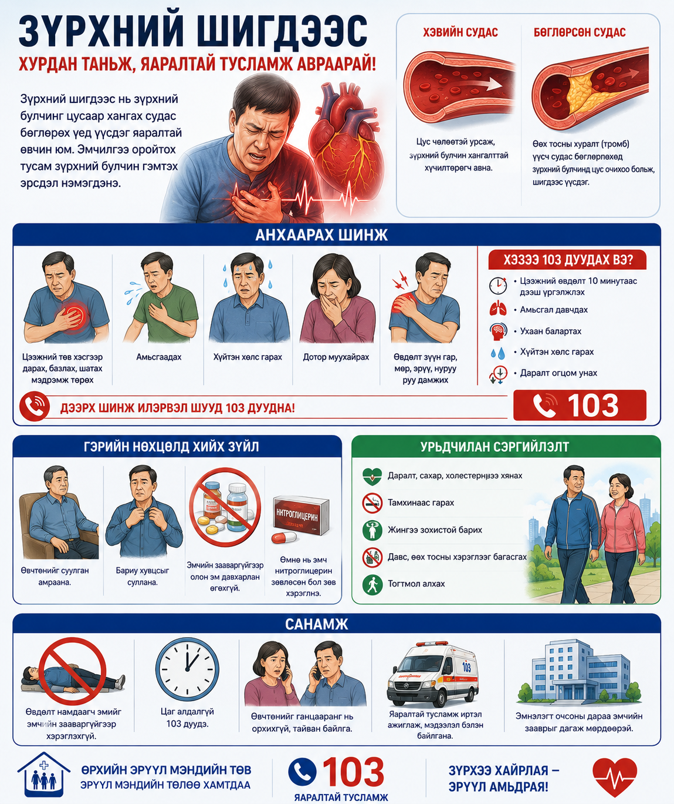
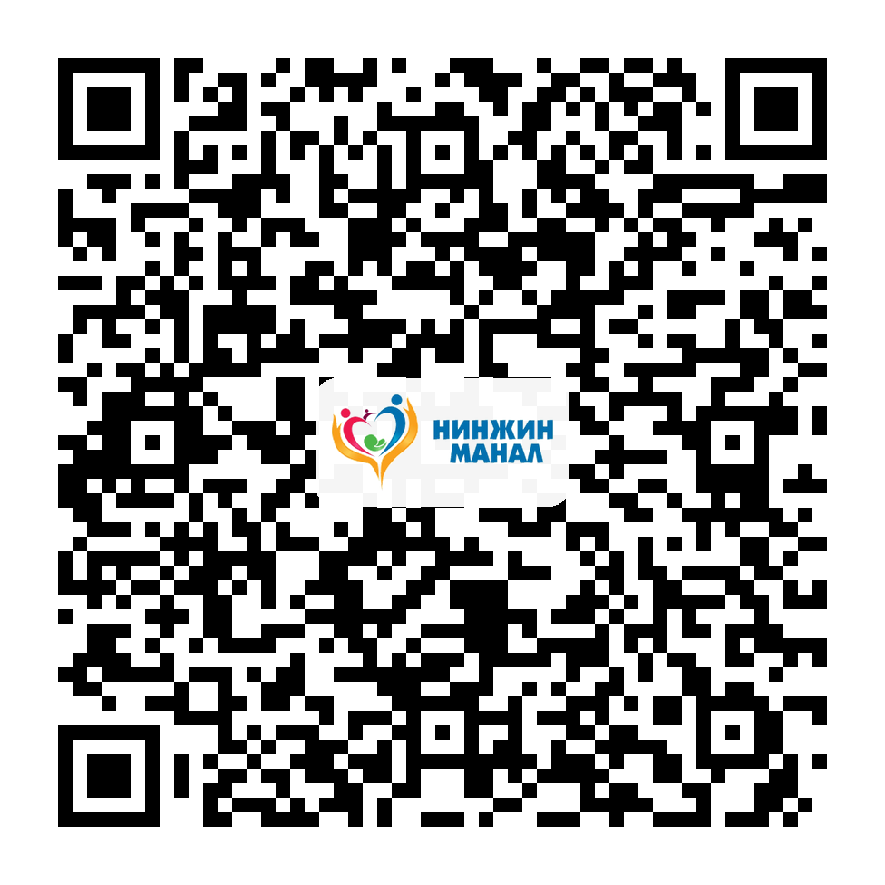

# Зүрхний шигдээс

Зүрхний булчинд очих цусны урсгал багасах эсвэл хаагдах үед зүрхний шигдээс үүсэж болно. Түргэн тусламж дуудах хугацаа нь амь нас, хүндрэлээс сэргийлэхэд чухал.

## Анхаарах шинж

Цээжээр дарах, шахах мэт өвдөх, амьсгаадах, хүйтэн хөлс гарах, дотор муухайрах, өвдөлт гар, эрүү, нуруу руу дамжих шинж илэрч болно.

## Хэзээ 103 дуудах вэ?

Цээжний өвдөлт 10 минутаас дээш үргэлжилбэл, амьсгаадах эсвэл ухаан балартах шинжтэй бол 103 дуудна.

## Хийж болохгүй зүйл

Өвдөлтийг “гайгүй болох байх” гэж хүлээхгүй. Дур мэдэн эм уухгүй. Өөрөө машин барьж эмнэлэг явахгүй.

## Урьдчилан сэргийлэлт

Даралт, холестерин, сахараа хянах, тамхинаас татгалзах, идэвхтэй хөдөлгөөн хийх нь чухал.

## A4 инфографик poster

Энэ сэдвийн A4 infographic poster доор preview хэлбэрээр байрласан. Poster-ийг томоор нээж, хэвлэх боломжтой.

<h3>Poster нээх</h3>
<a class="btn" href="print-heart-attack.html">A4 poster нээх / хэвлэх</a>

<h3>A4 poster QR</h3>

<strong>Нинжин манал ӨЭМТ</strong> 
Оюуны өмч: © АШУҮИС, оюутан Ш.Жамсранжамц 
Энэхүү мэдээлэл нь олон нийтийн эрүүл мэндийн боловсролд зориулагдсан бөгөөд эмчийн үзлэг, оношилгоо, эмчилгээг орлохгүй. 
<a href="https://www.facebook.com/profile.php?id=61575824979556" target="_blank" rel="noopener">Facebook хуудас</a>

