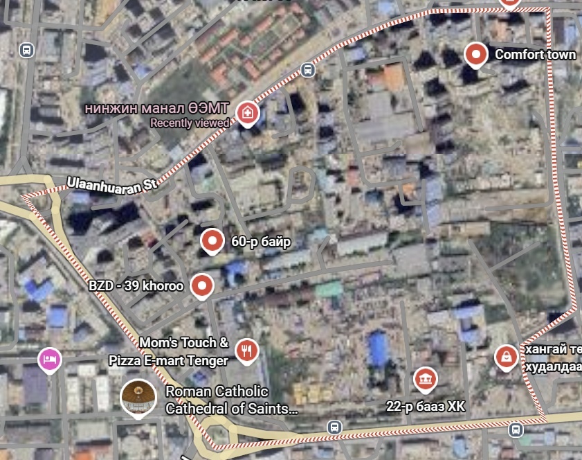
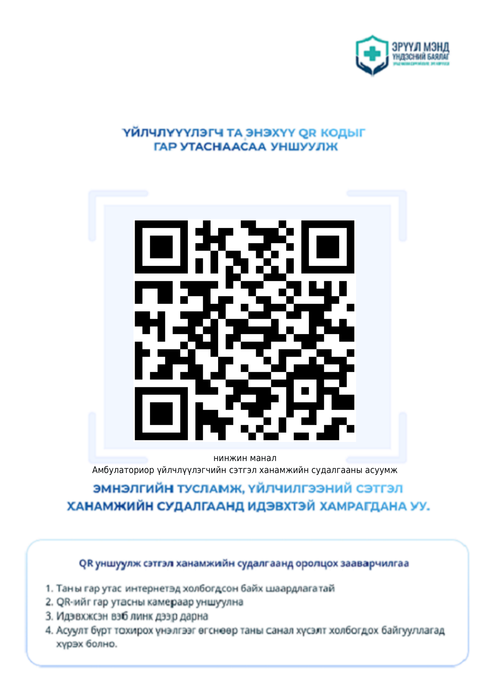

# Байгууллагын танилцуулга

  

  
<h3>Нинжин манал ӨЭМТ</h3>
Баянзүрх дүүргийн 39-р хорооны иргэдэд анхан шатны эрүүл мэндийн тусламж, үйлчилгээ үзүүлдэг өрхийн эрүүл мэндийн төв.

<a class="fb-btn mini-btn" href="https://www.facebook.com/profile.php?id=61575824979556" target="_blank" rel="noopener">f Facebook</a><a class="map-btn mini-btn" href="https://maps.app.goo.gl/ckenjwdCebmAd59W8" target="_blank" rel="noopener">📍 Google Maps</a>

## Эрхэм зорилго

Чадварлаг эмч мэргэжилтнүүд дэвшилтэд технологид тулгуурлан, үйлчлүүлэгчийн хэрэгцээг хангасан тэгш хүртээмжтэй тусламж, үйлчилгээг үзүүлнэ.

## Бидний уриа

<strong>Хүний төлөө - чадварлаг баг</strong>

## Үндсэн мэдээлэл

  
<strong>125 м²</strong>үйл ажиллагааны талбай

  
<strong>8131</strong>хамрагдах хүн ам

  
<strong>42</strong>хамрагдах байр

## Үйлчилгээний чиглэл

  
<h3>Эмчийн үзлэг</h3>
Өрхийн эмчийн үзлэг, зөвлөгөө, хяналт.

  
<h3>Лаборатори</h3>
Цусны ерөнхий шинжилгээ, сахар, ДОХ, тэмбүү, B/C вирусийн түргэвчилсэн шинжилгээ, умайн хүзүүний хорт хавдрын эрт илрүүлэг.

  
<h3>Багажийн шинжилгээ</h3>
Зүрхний цахилгаан бичлэг, ЭХО шинжилгээ.

  
<h3>Сэргээн засах ба гэрийн тусламж</h3>
Сэргээн засах үйлчилгээ, өдрийн эмчилгээ, гэрийн асаргаа.

## Байршил {#location}

  

  
<h3>БЗД 39-р хороо</h3>
Нинжин манал ӨЭМТ-ийн байршлыг доорх товчоор Google Maps дээр шууд нээнэ.

<a class="map-btn" href="https://maps.app.goo.gl/ckenjwdCebmAd59W8" target="_blank" rel="noopener">📍 Google Maps нээх</a>

## Сэтгэл ханамжийн судалгаа

  
  
<h3>Амбулаториор үйлчлүүлэгчийн сэтгэл ханамжийн судалгаа</h3>
Үйлчлүүлэгч та QR кодыг уншуулж судалгаанд хамрагдана уу.

<a class="btn" href="https://sudalgaa.1313.mn/forms/39/1" target="_blank" rel="noopener">Судалгаа бөглөх</a>

  
  
<strong>Нинжин манал ӨЭМТ</strong> 
  Оюуны өмч: © АШУҮИС, оюутан Ш.Жамсранжамц 
  Энэхүү мэдээлэл нь олон нийтийн эрүүл мэндийн боловсролд зориулагдсан бөгөөд эмчийн үзлэг, оношилгоо, эмчилгээг орлохгүй. 
  <a href="https://www.facebook.com/profile.php?id=61575824979556" target="_blank" rel="noopener">Facebook хуудас</a>

