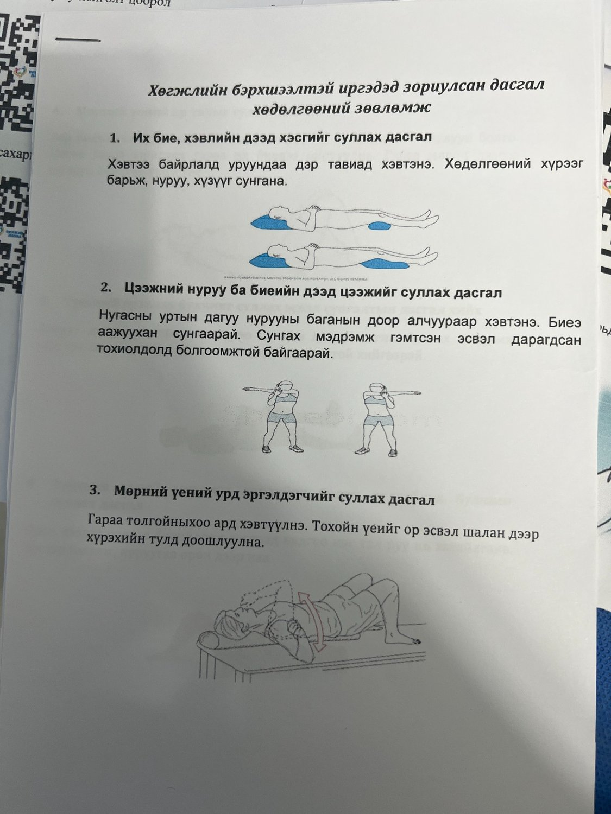
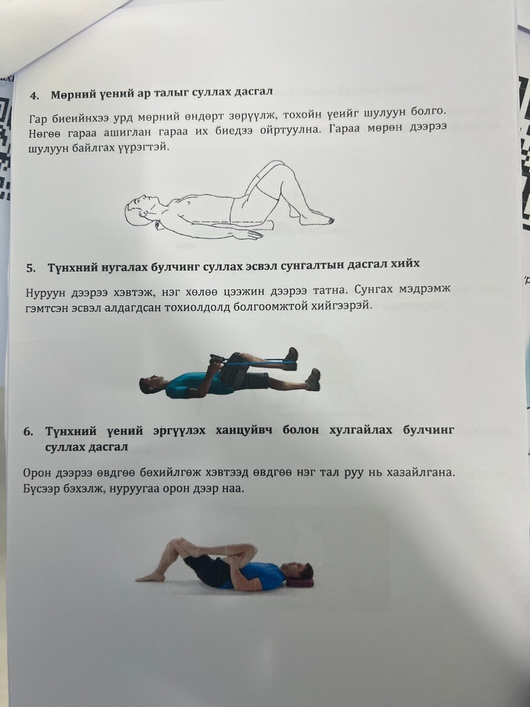
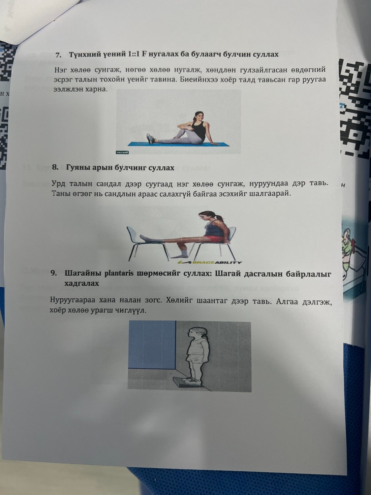
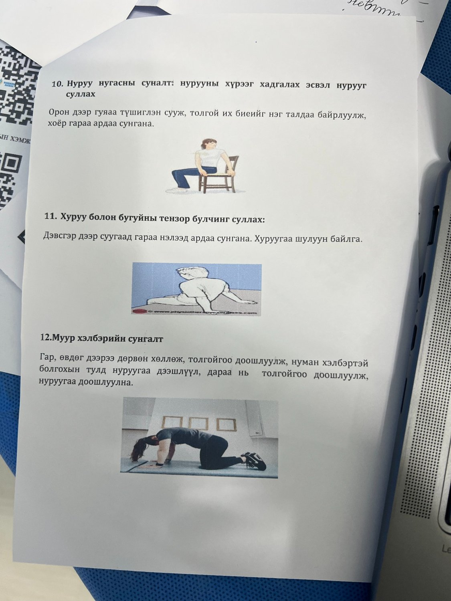

## Эхлэхийн өмнөх аюулгүй байдлын санамж

<strong>Заавал анхаар:</strong> Харвалтын дараах дасгалыг эмч, сэргээн засахын эмч, хөдөлгөөн засалчийн зөвлөгөөгөөр эхлүүлнэ. Шинээр сулрах, хэл яриа муудах, цээж өвдөх, амьсгал давчдах, унах эрсдэл, хүчтэй өвдөлт илэрвэл дасгалаа зогсоож 103 эсвэл эмчид хандана.

## Ерөнхий зарчим

- Дасгалыг өвдөлтгүй хүрээнд удаан, жигд хийнэ.
- Саажилттай мөчийг хүчээр татахгүй.
- Унах эрсдэлтэй бол заавал хүнтэй хамт хийнэ.
- Өдөр бүр богино хугацаагаар давтах нь нэг удаа хэт удаан хийхээс илүү аюулгүй.
- Амьсгалаа түгжихгүй, тайван амьсгална.

## Дасгалын төрлүүд

| № | Дасгал | Зорилго |
|---:|---|---|
| 1 | Их бие, хэвлийн дээд хэсгийг сунгах | Нуруу, хүзүү, цээжний хөшингө багасгах |
| 2 | Цээжний нуруу ба биеийн дээд цээжийг сунгах | Дээд нуруу, мөрний хөдөлгөөнийг дэмжих |
| 3 | Мөрний үений урд эргүүлэгчийг сунгах | Мөрний хөдөлгөөний хүрээг хадгалах |
| 4 | Мөрний үений ар талыг сунгах | Мөрний чангарал багасгах |
| 5 | Түнхний нугалах булчинг сунгах | Алхалт, босож суух хөдөлгөөнд туслах |
| 6 | Түнхний үеийн эргүүлэгч, хулгайлах булчинг суллах | Түнхний хөшингө багасгах |
| 7 | Түнхний үений 1:1 F нугалах ба булаагч булчинг суллах | Түнхний хөдөлгөөн сайжруулах |
| 8 | Гуяны арын булчинг сунгах | Өвдөг, түнхний уян хатан чанар нэмэх |
| 9 | Шагайн plantar шөрмөсийг сунгах | Шагайн байрлал, алхалтанд туслах |
| 10 | Нуруу нугасны сунгалт | Нурууны хөдөлгөөн хадгалах |
| 11 | Хуруу, бугуйн тенсор булчинг суллах | Гар, бугуйн чангарал багасгах |
| 12 | Муур хэлбэрийн сунгалт | Нурууны уян хатан хөдөлгөөн сайжруулах |

## Зурагтай материал

Доорх зургууд нь өмнө бэлдсэн дасгал хөдөлгөөний зөвлөмжийн эх материал юм. Хэвлэх хувилбар бэлтгэхдээ зураг бүрийн чанарыг сайжруулж, нэг дасгалыг нэг карт хэлбэрээр байрлуулахыг зөвлөе.

{.exercise-photo fig-alt="Хөгжлийн бэрхшээлтэй иргэдэд зориулсан дасгал хөдөлгөөний зөвлөмжийн 1-3 дасгал" width="70%"}

{.exercise-photo fig-alt="Мөр, түнхний сунгалтын дасгалууд" width="70%"}

{.exercise-photo fig-alt="Түнх, гуя, шагайн сунгалтын дасгалууд" width="70%"}

{.exercise-photo fig-alt="Нуруу, бугуй, муур хэлбэрийн сунгалтын дасгалууд" width="70%"}

<strong>Монгол тайлбар:</strong> Энэ хэсгийг иргэдэд өгөхдөө “өвдөлтгүй хүрээнд”, “хүнтэй хамт”, “эмч/засалчийн зөвлөгөөтэй” гэсэн 3 санамжийг хамгийн томоор байрлуулбал аюулгүй.

