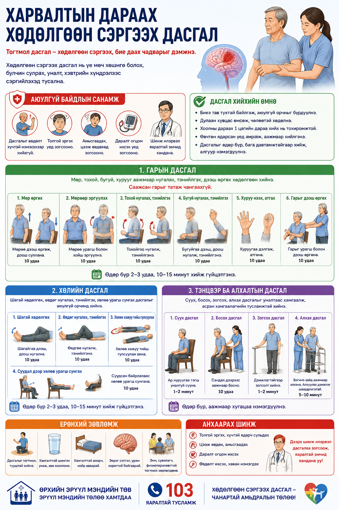
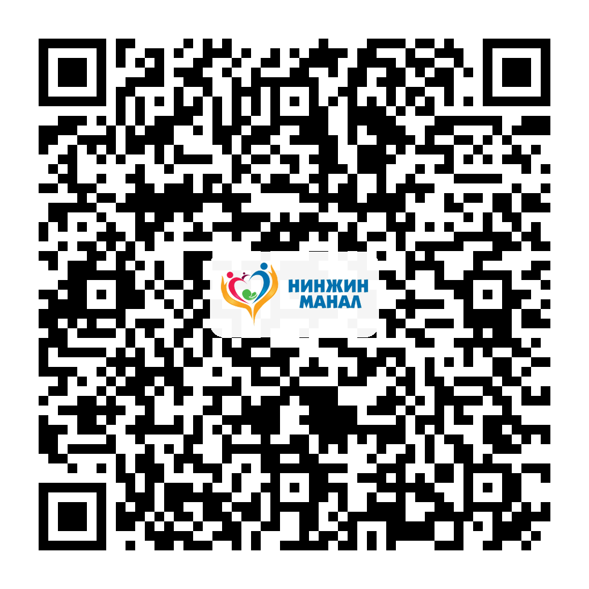

# Харвалтын дараах дасгал

Тархины харвалтын дараах саажилтын үед хөдөлгөөн сэргээх дасгалыг аюулгүй орчинд, эмч болон сэргээн засах мэргэжилтний зөвлөгөөгөөр хийвэл зохистой.

## Аюулгүй байдал

Дасгалыг унах эрсдэлгүй орчинд, өвдөлт үүсгэхгүйгээр хийж, толгой эргэх, амьсгаадах, өвдөх үед зогсооно.

## Гарын дасгал

Мөр, тохой, бугуй, хурууг аажмаар хөдөлгөж, сунгалт болон идэвхтэй хөдөлгөөнийг бага багаар нэмэгдүүлнэ.

## Хөлийн дасгал

Сандал дээр сууж хөл өргөх, шагай хөдөлгөх, дэмжлэгтэй босож суух зэрэг дасгалыг өөрийн боломжид тааруулан хийнэ.

## Асран хамгаалагчид

Дасгалын үед унах, ядрах, өвдөх шинжийг ажиглаж, хэт ачаалал өгөхгүй.

## A4 инфографик poster

Энэ сэдвийн A4 infographic poster доор preview хэлбэрээр байрласан. Poster-ийг томоор нээж, хэвлэх боломжтой.

  

  
<h3>Poster нээх</h3>
<a class="btn" href="print-post-stroke-exercises.html">A4 poster нээх / хэвлэх</a>

  
<h3>A4 poster QR</h3>

  
  
<strong>Нинжин манал ӨЭМТ</strong> 
  Оюуны өмч: © АШУҮИС, оюутан Ш.Жамсранжамц 
  Энэхүү мэдээлэл нь олон нийтийн эрүүл мэндийн боловсролд зориулагдсан бөгөөд эмчийн үзлэг, оношилгоо, эмчилгээг орлохгүй. 
  <a href="https://www.facebook.com/profile.php?id=61575824979556" target="_blank" rel="noopener">Facebook хуудас</a>

