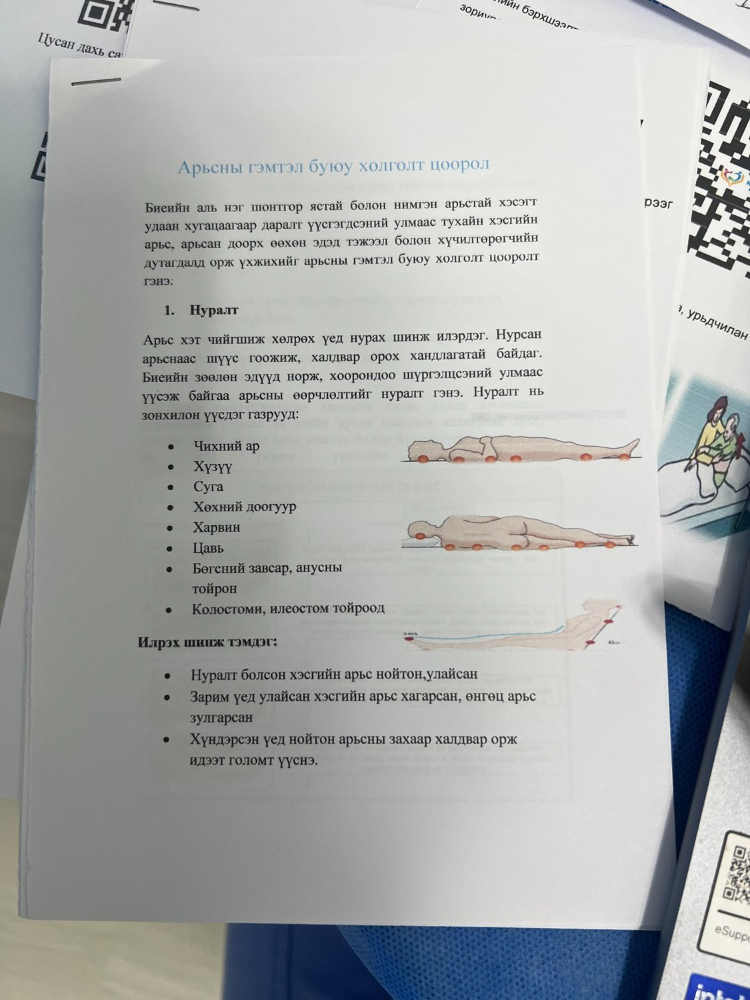
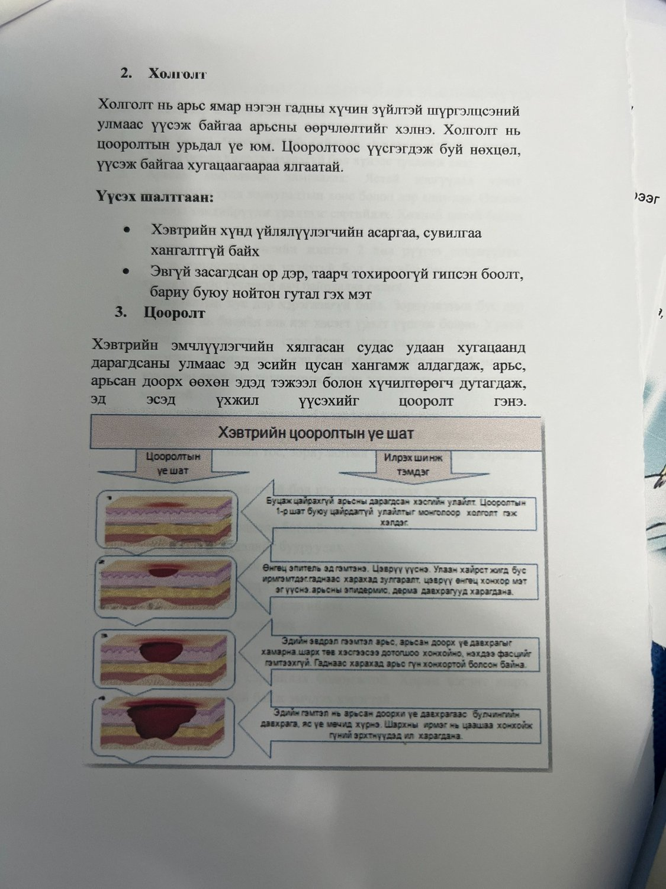
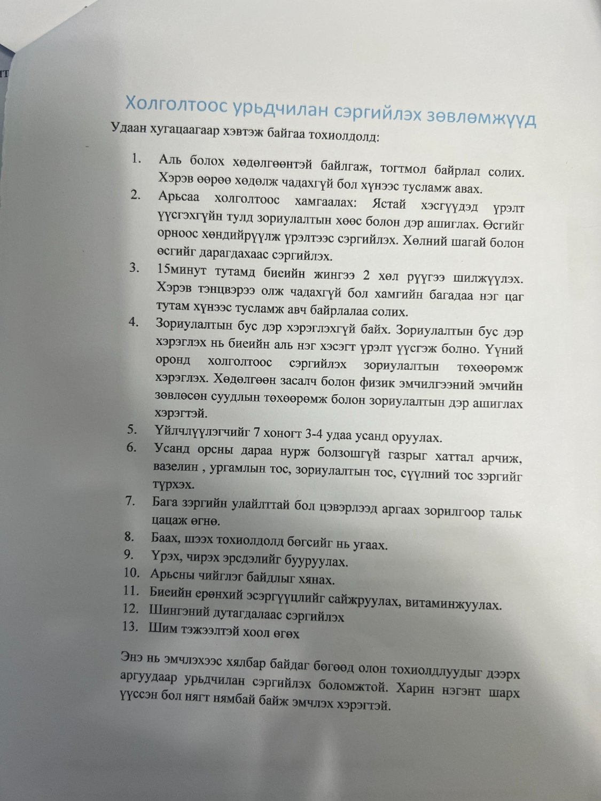

## Холголт, цооролт гэж юу вэ?

Биеийн яс товгор хэсэг удаан хугацаагаар дарагдах, арьс чийгтэй байх, үрэлт ба чирэгдэл үүсэх үед арьс болон арьсан доорх эд гэмтэж болно. Үүнийг холголт, даралтын гэмтэл, цооролт гэж нэрлэдэг.

<strong>Анхны шинжийг үл тоомсорлож болохгүй:</strong> Улайсан хэсэг дарахад цайхгүй байх, арьс халуун/хүйтэн болох, өвдөх, цэврүү үүсэх, арьс шалбарсан бол эмч, сувилагчид эрт үзүүлнэ.

## Их үүсдэг хэсгүүд

- Чихний ар
- Хүзүү
- Дагз
- Нуруу, дал
- Тохой
- Хөхний доогуур, хэвлийн нугалаас
- Ууц, өгзөг, анус орчим
- Цавь
- Өвдөг, шагай, өсгий
- Колостоми, илеостом орчим

## Урьдчилан сэргийлэх 13 зөвлөмж

1. Аль болох хөдөлгөөнтэй байлгаж, байрлалыг тогтмол солино.
2. Өөрөө хөдөлж чадахгүй бол асран хамгаалагчийн тусламжтай байрлал солино.
3. Ястай хэсэгт зориулалтын дэр, зөөлөвч, даралт бууруулах хэрэгсэл ашиглана.
4. Өсгий, шагай, тохой зэрэг хэсгийг шууд дарагдахаас хамгаална.
5. Зориулалтын бус хэрэгслийг буруу байрлуулахгүй.
6. Арьсыг өдөр бүр шалгаж, улайсан эсэхийг харна.
7. Арьсыг хуурай, цэвэр байлгана.
8. Хөлс, шээс, баас хүрсэн бол шууд цэвэрлэж, хатаана.
9. Усанд оруулсны дараа арьсны нугалаас, чийгтэй хэсгийг сайн хатаана.
10. Чийгшүүлэгч тосыг тохирох хэсэгт нимгэн түрхэнэ.
11. Үрэх, чирэх хөдөлгөөнөөс болгоомжилно.
12. Шингэн дутагдал, хоол тэжээлийн дутагдлаас сэргийлнэ.
13. Улайсан, шалбарсан, цэврүүтсэн хэсгийг эрт сувилагч/эмчид үзүүлнэ.

## Байрлал солих энгийн санамж

| Нөхцөл | Санамж |
|---|---|
| Орон дээр хэвтдэг | Байрлал солих давтамжийг эрсдэл, арьсны байдал, дэр/матрасаас хамаарч эмч/сувилагчтай тохируулна |
| Сандал/тэргэнцэр дээр суудаг | Боломжтой бол богино хугацаанд жингээ шилжүүлэх хөдөлгөөн хийлгэнэ |
| Өөрөө хөдөлж чаддаггүй | Асран хамгаалагч татаж чирэхгүй, даавуу/гулсуур ашиглан байрлал солино |

## Зурагтай эх материал

{.exercise-photo fig-alt="Арьсны гэмтэл, холголт цооролтын тухай эх материал" width="70%"}

{.exercise-photo fig-alt="Холголт ба цооролтын тайлбар, үе шат" width="70%"}

{.exercise-photo fig-alt="Холголтоос урьдчилан сэргийлэх зөвлөмжүүд" width="70%"}

<strong>Монгол тайлбар:</strong> Холголт, цооролтыг эмчлэхээс илүү урьдчилан сэргийлэх нь амар. Өдөр бүр арьс шалгах, байрлал солих, чийг ба үрэлтээс хамгаалах нь хамгийн чухал.

