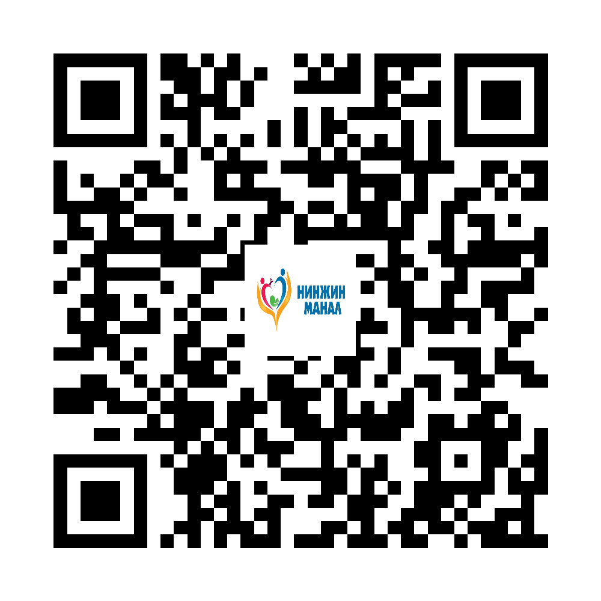

Тархины цус харвалт

Нинжин манал ӨЭМТ — олон нийтэд зориулсан зөвлөмж

<h3>Товч ойлголт</h3>
Тархины цус харвалт нь тархины судас бөглөрөх эсвэл хагарах үед үүсдэг яаралтай тусламж шаарддаг өвчин юм. Эмчилгээ эрт эхлэх тусам саажилт, хэл ярианы алдагдал, амь насанд аюултай хүндрэлээс сэргийлэх боломж нэмэгдэнэ.

<h3>FAST аргаар шинж таних</h3>
Face: нүүрний нэг тал унжих. Arm: нэг гар сулрах эсвэл өргөж чадахгүй болох. Speech: хэл яриа ээдрэх, ойлгомжгүй болох. Time: эдгээр шинж илэрвэл цаг алдалгүй 103 дуудна.

<h3>Яаралтай тусламж дуудах шинж</h3>
Гэнэт гар, хөл сулрах, хэл яриа өөрчлөгдөх, ам муруйх, хараа гэнэт муудах, хүчтэй толгой өвдөх, ухаан балартах шинж илэрвэл гэртээ ажиглаж хүлээхгүй.

<h3>Урьдчилан сэргийлэлт</h3>
Даралт, цусан дахь сахар, холестеринээ хянах, тамхи татахгүй байх, архины хэрэглээг багасгах, тогтмол хөдөлгөөн хийх, эмчийн бичсэн эмийг дур мэдэн зогсоохгүй байх.

<h3>Иргэдэд өгөх санамж</h3>
Харвалтын үед өвчтөнд хоол, ус, эм дур мэдэн өгөхгүй. Ухаангүй бол хажуу тийш харуулж, амьсгалын замыг чөлөөтэй байлгана. Яаралтай тусламж иртэл тайван байлгаарай.

© АШУҮИС, оюутан Ш.ЖамсранжамцЭмчийн үзлэг, оношилгоо, эмчилгээг орлохгүй.

