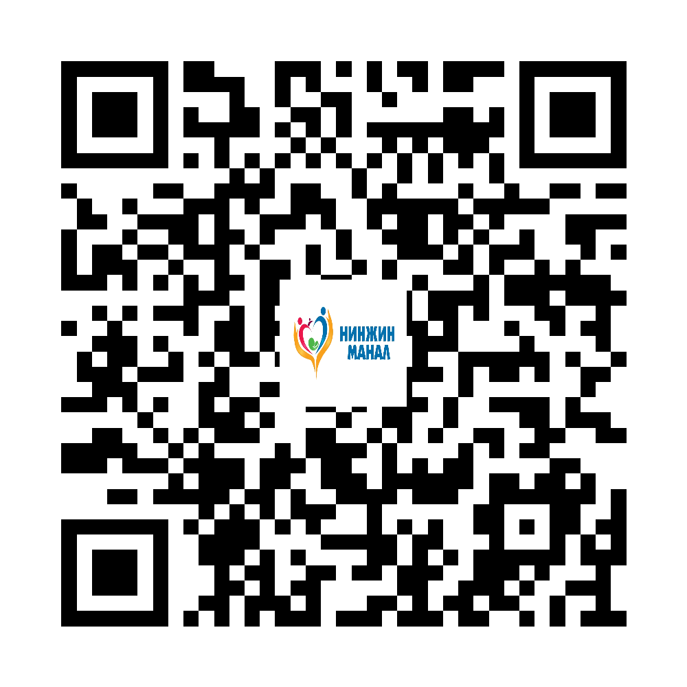

## Сайтын нүүр болон сэдэв тус бүрийн QR

<h3>Нүүр хуудас</h3>
<small>https://jamsranjamts.github.io/family-medicine-health-education/index.html</small>

<h3>Тархины цус харвалт</h3>
<small>https://jamsranjamts.github.io/family-medicine-health-education/stroke.html</small>

<h3>Зүрхний шигдээс</h3>
<small>https://jamsranjamts.github.io/family-medicine-health-education/heart-attack.html</small>

<h3>Эпилепси</h3>
<small>https://jamsranjamts.github.io/family-medicine-health-education/epilepsy.html</small>

<h3>Бөөрний дутагдал</h3>
<small>https://jamsranjamts.github.io/family-medicine-health-education/kidney-failure.html</small>

<h3>Аутизм ба дэмжих засал</h3>
<small>https://jamsranjamts.github.io/family-medicine-health-education/autism.html</small>

<h3>Харвалтын дараах дасгал</h3>
<small>https://jamsranjamts.github.io/family-medicine-health-education/post-stroke-exercises.html</small>

<h3>Холголт, цооролт</h3>
<small>https://jamsranjamts.github.io/family-medicine-health-education/pressure-injury.html</small>

## A4 хэвлэх хувилбаруудын QR

<h3>Тархины цус харвалт — A4 хэвлэх</h3>
<small>https://jamsranjamts.github.io/family-medicine-health-education/print/stroke-print.html</small>

<h3>Зүрхний шигдээс — A4 хэвлэх</h3>
<small>https://jamsranjamts.github.io/family-medicine-health-education/print/heart-attack-print.html</small>

<h3>Эпилепси — A4 хэвлэх</h3>
<small>https://jamsranjamts.github.io/family-medicine-health-education/print/epilepsy-print.html</small>

<h3>Бөөрний дутагдал — A4 хэвлэх</h3>
<small>https://jamsranjamts.github.io/family-medicine-health-education/print/kidney-failure-print.html</small>

<h3>Аутизм ба дэмжих засал — A4 хэвлэх</h3>
<small>https://jamsranjamts.github.io/family-medicine-health-education/print/autism-print.html</small>

<h3>Харвалтын дараах дасгал — A4 хэвлэх</h3>
<small>https://jamsranjamts.github.io/family-medicine-health-education/print/post-stroke-exercises-print.html</small>

<h3>Холголт, цооролт — A4 хэвлэх</h3>
<small>https://jamsranjamts.github.io/family-medicine-health-education/print/pressure-injury-print.html</small>

<strong>Нинжин манал ӨЭМТ</strong>

© АШУҮИС, оюутан Ш.Жамсранжамц

Энэхүү мэдээлэл нь олон нийтийн эрүүл мэндийн боловсролд зориулагдсан бөгөөд эмчийн үзлэг, оношилгоо, эмчилгээг орлохгүй. Яаралтай шинж илэрвэл 103 болон ойролцоох эрүүл мэндийн байгууллагад хандана уу.

