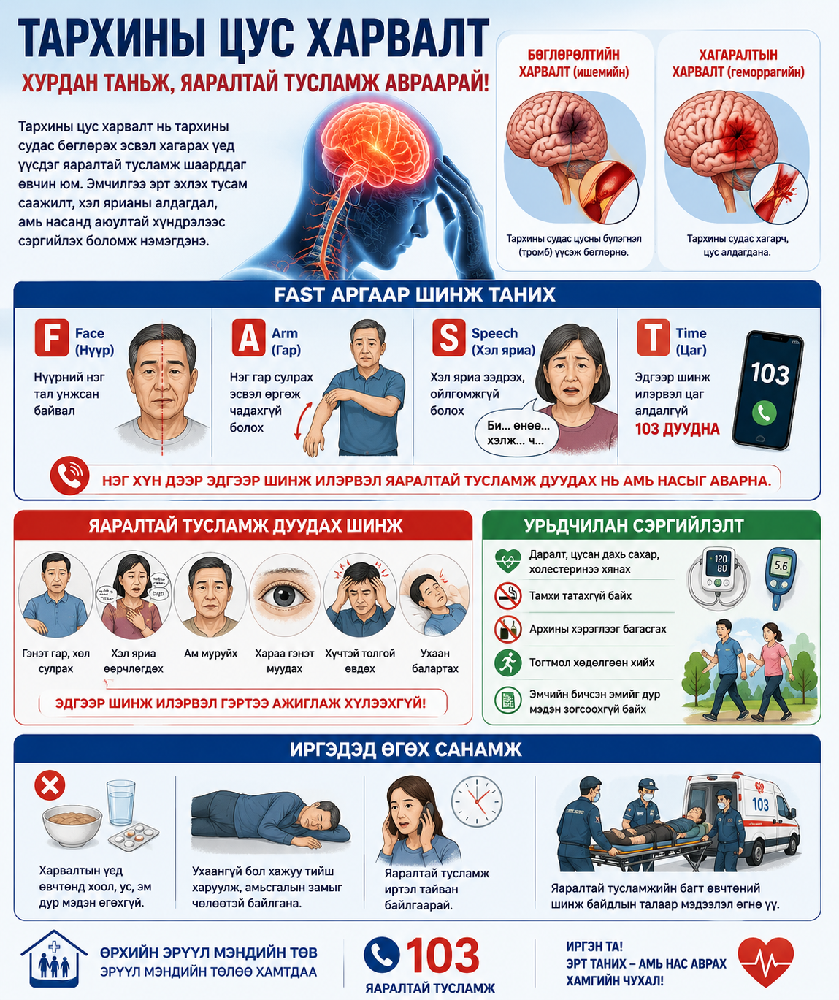

# Тархины цус харвалт

Тархины цус харвалт нь тархины судас бөглөрөх эсвэл хагарах үед үүсдэг яаралтай тусламж шаарддаг өвчин юм. Эрт таньж, 103 дуудсанаар амь нас болон хөдөлгөөн, хэл ярианы хүндрэлээс сэргийлэх боломж нэмэгдэнэ.

## Товч ойлголт

Тархины эд хүчилтөрөгч, шим тэжээлээр дутагдахад эс гэмтэж эхэлдэг. Иймээс цаг алдалгүй эмнэлэгт хүргэх нь хамгийн чухал.

## FAST шинж

Нүүрний нэг тал унжих, нэг гар сулрах, хэл яриа ээдрэх, ойлгомжгүй болох шинж илэрвэл цаг алдалгүй 103 дуудна.

## Яаралтай шинж

Гэнэт гар, хөл сулрах, хараа гэнэт муудах, хүчтэй толгой өвдөх, ухаан балартах нь аюултай шинж.

## Иргэдэд өгөх санамж

Харвалтын үед гэртээ ажиглаж хүлээхгүй. Хоол, ус, эм дур мэдэн өгөхгүй. Ухаангүй бол хажуу тийш харуулна.

## A4 инфографик poster

Энэ сэдвийн A4 infographic poster доор preview хэлбэрээр байрласан. Poster-ийг томоор нээж, хэвлэх боломжтой.

  

  
<h3>Poster нээх</h3>
<a class="btn" href="print-stroke.html">A4 poster нээх / хэвлэх</a>

  
<h3>A4 poster QR</h3>

  
  
<strong>Нинжин манал ӨЭМТ</strong> 
  Оюуны өмч: © АШУҮИС, оюутан Ш.Жамсранжамц 
  Энэхүү мэдээлэл нь олон нийтийн эрүүл мэндийн боловсролд зориулагдсан бөгөөд эмчийн үзлэг, оношилгоо, эмчилгээг орлохгүй. 
  <a href="https://www.facebook.com/profile.php?id=61575824979556" target="_blank" rel="noopener">Facebook хуудас</a>

